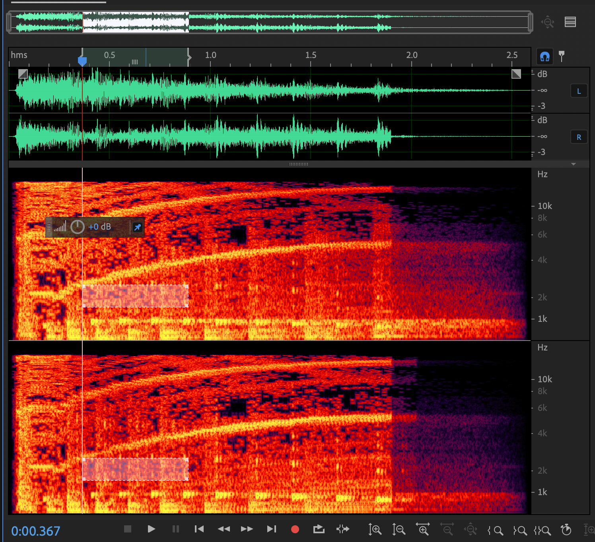

# DAD 492 – Sound Forensics

This course is an introduction audio forensics, a branch in the larger field of forensic science. Audio forensics is the application of the science of digital audio to legal matters. This niche field of forensics has grown exponentially in recent years due to near ubiquity of devices that can make audio forensic evidence such as smart phones or surveillance cameras. It is inevitable that some of the recordings captured everyday will be considered useful as evidence in an investigation. 

- [syllabus](pages/syllabus)
- [schedule](pages/schedule)
- [projects](pages/projects)
- [resources](pages/resources)
