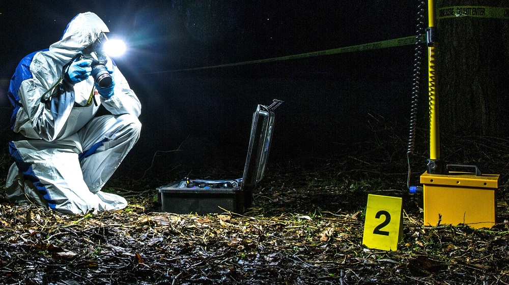
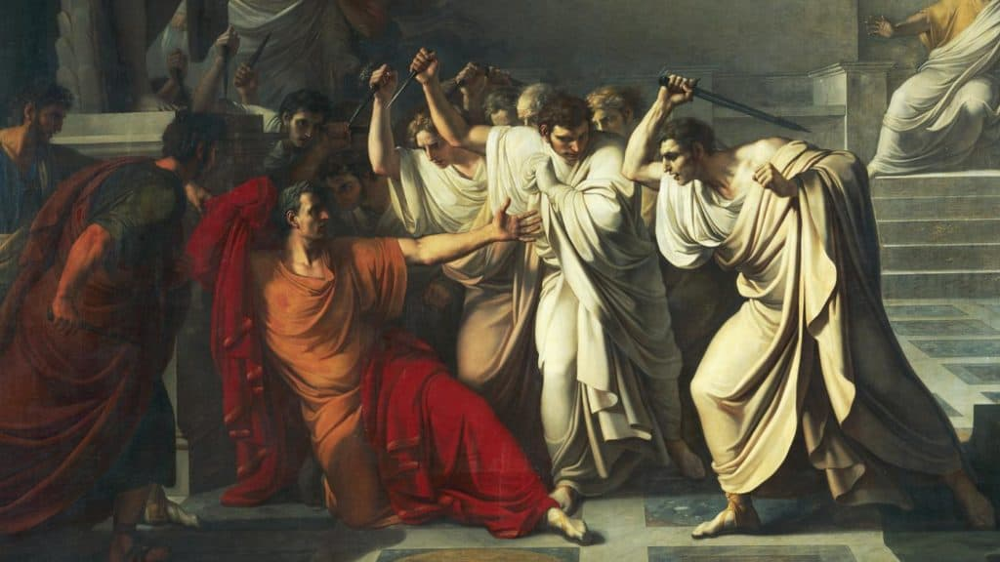
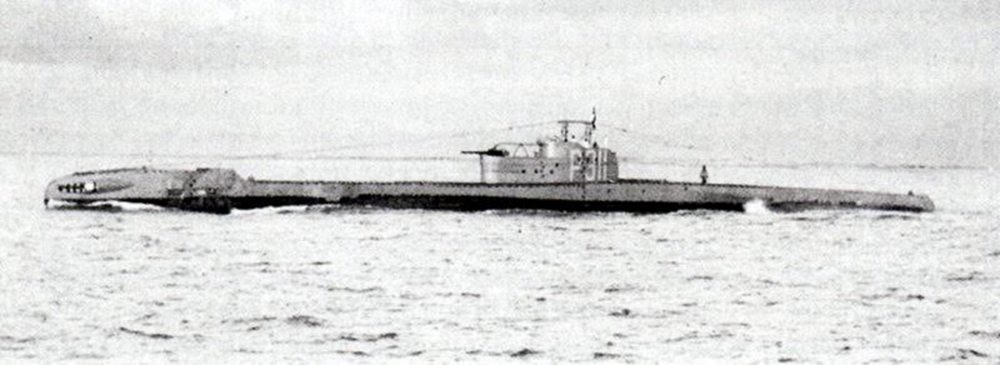
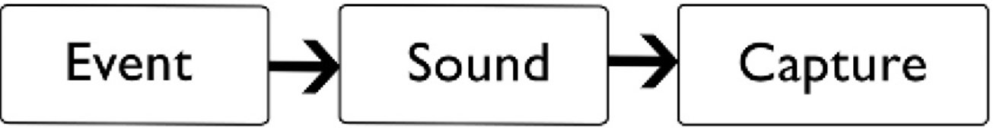
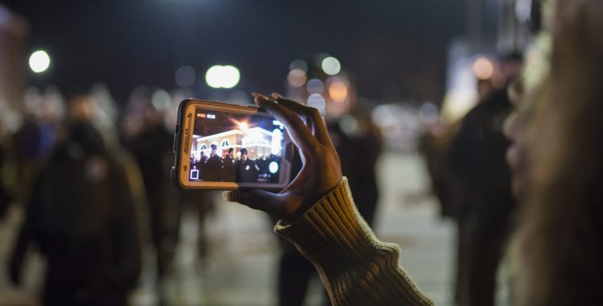
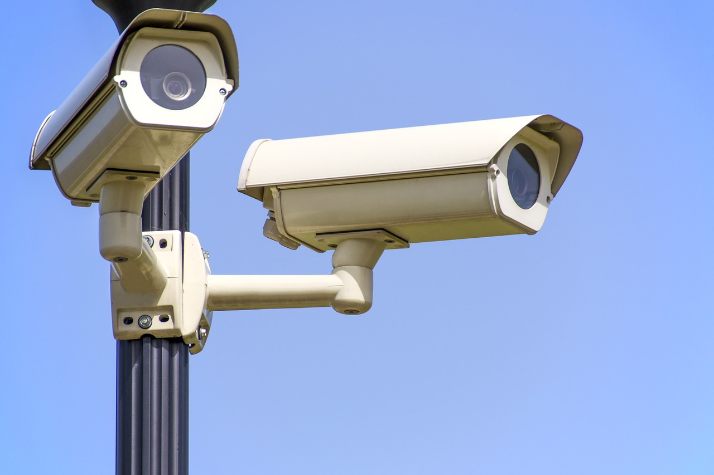

+++
title = "Forensic Audio"
outputs = ["Reveal"]
theme = "moon"
[reveal_hugo]
margin = 0.2
separator = "##"
+++

## Forensics

{}
Audio forensics is a field of science that deals with the study of digital audio files. It is a subfield of digital forensics. It's only a small part of the broader field of forensic science.
{{/ note %}}

---

{}
the actual inception of this word harks back to 44 bc and the post-mortem examination of the infamous Roman leader, Julius Caesar. Upon performing his investigation, the physician, Antistius, arrived at the conclusion that Caesar had been stabbed a total of 23 times, and that it was the second piercing of the chest that inflicted the fatal blow. Once his analysis was completed, he was asked to present his findings ‘before the forum,’ an archaic version of the court system used across the world today.
{{/ note %}}

---

{}
As the capture of audio became more likely, developments in the field of audio analysis were also picking up steam. The first use of audio analysis was born out of necessity during the First World War when the US- based Bells Labs created a system to identify submarines. Once the war was over, a company named Kay Electric made the product commercially available, and in 1951 trademarked and marketed it as ‘The Sonagraph,’ producing graphs known as ‘Sonograms’ (Vale, 2019).
{{/ note %}}

---
 
 

{}
Lots of vibrations are happening all the time. Only some of them are within our range of hearing, and only some of them are recorded. 
{{/ note %}}

---

Audio forensics is the **acquisition**, **analysis**, and **interpretation** of audio recordings as part of an official investigation, such as in preparation for a civil or criminal trial, or as part of the investigation of an accident or some other incident involving audio evidence.

---

## Authenticity 

* was the recording tampered with?
* was the recording made when it says it was made in the metadata?
* was the recording made in the place we think it was made? 

{}
Audio forensic examiners must assess the chain of custody of the evidence, take steps to uncover deliberate tampering, and provide safeguards to protect against inadvertent alteration.
{{/ note %}}

---

## Audio enhancement 

{}
* we need to fix recordings that took place in non-ideal acoustic circumstances 
    *  poor microphone position, strong or fluctuating background noise, the talkers may not enunciate clearly, the signal of interest is weak, etc.
 *  we must emphasize what information is important and de-emphasize what is not
 *  this is especially important when audio is being presented in a trail; judges and juries don't have the same expertise that we might have listening to noisey recordings
{{/ note %}}

---

## Interpretation 

* reconstructing timelines
* transcribing dialogue
* identifying unknown sounds 

{}
These are determinations made by the forensic analyst based on an investigator’s theory about the circumstances of a crime, or in the context of other physical evidence and witness accounts.
{{/ note %}}

---

{}
Audio recordings provide several potential advantages for an investigation compared to film, video, and eyewitness observations, such as the ability to collect information from all directions, not just in a particular field of view. Audio recordings provide a sequential time record of events as an objective observation, rather than as a witness’ subjective recollection.
{{/ note %}}

---

## Shortcomings of audio recordings

* difficulty determining direction and orientation of the sound source 
* limited dynamic range 
* interfering noise or extraneous noise

{}
Audio recordings may also have obvious shortcomings in an investigation, such as the general difficulty in determining direction and orientation of the sound source with respect to the recording microphone if only a single, monophonic recording is available. 

Other shortcomings may include the limited dynamic range of the record- ing: very subtle and quiet sounds may not appear with sufficient resolution in the recording, while very loud sounds may be “clipped” if they exceed the maximum limit of the recording system. 

Perhaps the most common issue with forensic audio recordings is the presence of interfering noise or extraneous sounds that can obscure the low-level sounds of interest to the investigation. 

Recordings that are of very high quality and intelligibility are often used directly by the individuals performing the investigation without being presented to an audio forensic examiner.
{{/ note %}}