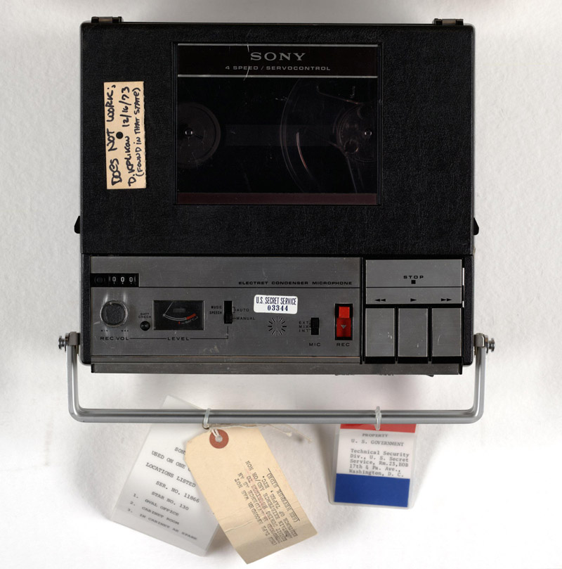
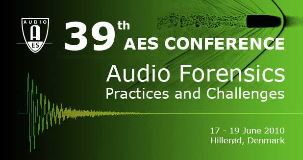
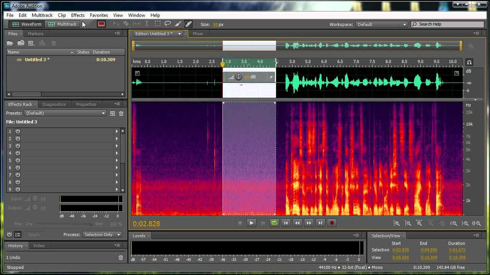

+++
title = "Forensic Audio"
outputs = ["Reveal"]
theme = "moon"
[reveal_hugo]
margin = 0.2
separator = "##"
+++

A very short introduction to forensic audio

---

Nixon Tapes

{}
Started in the 1970s.

Dr. Thomas Stockham, Jr. - of soundstream

Inventor of first digital audio workstation 

Figured out that the tapes had been erased 9x
{}

---

Started in 1992

{}
1. To extend knowledge
2. to write standards
3. to identify areas of new research 
{}

---

# Forensic audio areas

---

# Audio enhancement

{}
Not to produce perfect audio but to increase intelligibility 

To determine what has been said in a recording
{}

---

# Audio authenticity

* has the recording been edited or modified? 
* The Nixon tapes were an example of this 
  
---

# Voiceprint identification

* Determine the identity of a person in a recording