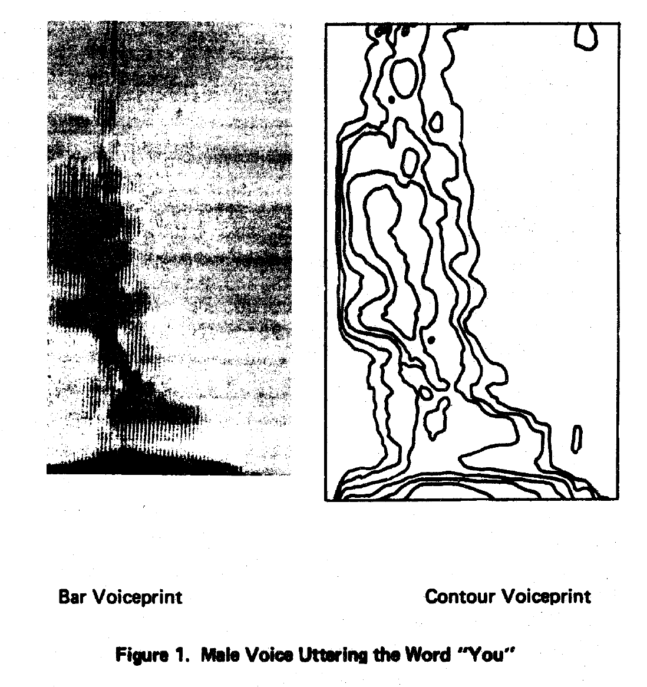

+++
title = "Speech Forensics"
outputs = ["Reveal"]
[reveal_hugo]
theme = "solarized"
# show_notes = "separate-page"
+++

# Speech forensics

---

## Subfields 

* Speech recognition - speech to text
* Speaker verification - is the speaker the correct person? 
* Speaker identification - speaker identity is unknown 

{}
**Speech recognition** is a term used to refer to systems which decode the actual words of which speech is composed. It can be applied to audio recordings or calculated in real-time, for instance, in speech-to-text applications. It generally has no use in forensics so it will not be discussed further.

**Speaker verification** is used to compare the voice of a known speaker who is willing to cooperate against that of an unknown speaker and is, therefore, a binary decision (either it is the correct speaker, or it is not). This type of system has applications for security purposes, for example, identity checks when calling a bank. Again, this has little use in audio forensics.

**Speaker identification** is used when the identity of a speaker is unknown, and so rather than verify the voice against that of a known speaker as in the previous subfield, anybody within a relevant population could be the speaker.

Difficulties of identification include:
* distortion caused by clipped samples;
* non-contemporary voice samples which may be several years old;
* speakers who are unwilling to cooperate in providing samples of their voice; 
* open-ended data sets (you can never be sure that the criminal is among the suspects)
  
---

## History 

{}
Voiceprint was coined by Grey and Kopp (1944). They wanted to use spectrograph representations to extract identifying features of a voice, similar to identifying features within fingerprints, hence the term ‘voiceprint.’

In the 1960s the New York Police Department made contact with Bell Labs in the early 1960s with a request for help in relation to cases involving phone calls in which the identification of suspects was sought (Smith, 2006). An employee of Bell Labs led the efforts to further the research and develop a methodology for a spectrographic voice by publishing his research (Kersta, 1962). It was claimed the method had an error rate below 1 per cent, a statement which was challenged to some degree by other scientists who all reported much higher error rates of between 18–50 per cent when attempting to reproduce the experiments.

This image comes from Kerstas published research attempting to associate spectrograms more closely with fingerprints. 

---

## Research basis 

>The data suggest that the value of spectrograms for speaker identification purposes is limited to use as an investigating aid, and then only if speech samples of similar context and adequate duration are compared.

Hazen, 1973

{}
The FBI have an identification lab but they don't present their findings in court, and only use them for investigative purposes.

---

## Variables

* Intrinsic - relating to the voice 
* Extrinsic - to the capture device

{}
The **intrinsic variations** are all related to the behavior of a speaker during speech production, for example, the words spoken, and their mental or physical state at the time of capture. When you consider the majority of audio recordings used in a forensic context are captured during an event (an obvious example being a criminal act of some description), the speaker may be physically exerting themselves in some manner, such as running or fighting. They may also be intoxicated. They are also likely to be under some form of stress, which could cause further deviation from the characteristics of their voice under normal conditions.

**Extrinsic variations** relate to effects after the speech has been produced, such as variations in the method of capture and the recording conditions (Drygajlo et al., 2016). For example, questioned recordings are typically from a phone call and captured in less than ideal conditions. In light of this, they often have low signal-to-noise ratios, contain overlapping speech, reverberation, and distortions. As telephones have a low bandwidth and use codecs for compression, aspects of the speech signal are also artificially attenuated (Künzel, 2001).

Issues can arise when comparing a suspect recording to an evidence recording because the suspect recording is made under more ideal conditions than the evidence recording. The speakers 

Further to this, **intrinsic variations** can result in differences between the speech produced by the same speaker (known as **intra-variation**). For analysis to be conducted, these potential differences must be understood as not to be attributed to being from a different speaker and causing a false negative. The differences between two different speakers, caused by biological factors, such as vocal tract length, and social factors, such as age, sex, regional background, and ethnicity, are known as **inter-variations** (Morrison and Thompson, 2016).

---

## Analysis methods 

* Auditory 
* Acoustic phonetic 
* Spectrographic 
* Automatic 

---

## Auditory analysis 

* requires the most evidence 
* expert comments on similarities and differences between recordings 
    *  dialect, laryngeal activity, and speech impediments
* qualitative - reproducibility is difficult 

---

## Acoustic phonetic analysis

* Quantitative measurements 
* formant - the resonant frequency of a vowel that reflects the articulatory configuration, shape, and size of the vocal tract.
    * phonemes, allophones, or stretches of speech 
* Fundamental frequency and formant frequency 

{}
quantitative measurements of the acoustic properties of the voice (such as formants and the fundamental frequency) before analysis of the numerical data is performed. 

**Formants** are defined as the resonant frequency of a vowel that reflects the articulatory configuration, shape, and size of the vocal tract. comparable units are first defined, such as **phonemes, allophones, or stretches of speech**.

**Phonemes** are distinctive classes of actual speech sounds formed by phones

**allophones** is the collective name given to all phones

Measurements can also be made periodically, for example, by calculating the fundamental frequency and formant frequencies of regions which contain speech over regular intervals. The measurements for this technique are made using software under human supervision.

---

## Spectrographic analysis

* visual spectrogram analysis 
* compare speech between a known speaker and set of foil speakers 

{}
In order for this to be achieved, the suspect (and a set of foil speakers) must read the same phrase verbatim, using the same vocal effort, speech rate, and other factors to ensure the recordings are as similar as possible. To obtain intra-speaker variability, different phrases and repetitions of the same phrases are collected. Comparisons of various visual aspects within the spectrogram are then performed, including the general formant shaping and position, the energy distribution, pitch striations, and word length, followed by a comparison of audible features, such as pitch, stress, and word rate.

This form of analysis is obviously subjective, so this approach has been augmented with computers to make objective measurements of the spectrogram. Conclusions are stated on a subjective posterior probability scale with gradations such as probable identification, possible identification, inconclusive. Posterior odds refer to the probability of the prosecution hypothesis versus the probability of the defence hypothesis given the evidence, whereas a priori odds refer to the probability of the prosecution hypothesis versus the probability of the defence hypothesis, prior to taking the evidence into account (Morrison, 2014).

---

## Automatic analysis

* technology developed for security and banking industries 
* analysis using Mel Frequency Cepstrum Coefficients (MFCC)
* Mel scale - a frequency scale that is used to represent the frequency domain of a signal.
     * based on human perception 

{}
Conversion to this scale is performed by measuring the spectrum in a 20–30 ms frame before the frame moves in 10–20 ms steps across areas in which speech is present. This process produces a series of sequential MFCC measurements. Other techniques use higher-level features based on phonetic units, such as phenomes, word or phrase length (Morrison, 2013).

The advantage of this approach is that it is fully automatic and so eliminates bias, is objective, can be validated and provides results in a likelihood ratio format. The examiner’s role is limited to only the input of recordings and the reading of the result at the output.

---

## Reporting methods 

* Binary decision 
* classical probability scale 
* Likelihood ratios 
    * LR=p(E|Hp)p(E|Hd)

{}
Most commonly used methods of reporting. 

* Binary decision 
    * Either it is the voice or it isn't  
* classical probability scale 
    * This reports the probability of the unknown and known voice being from the same speaker, and is typically a verbal scale which includes a number of steps such as ‘highly likely to be the same voice/highly unlikely to be the same voice.’  
* Likelihood ratios 
    * Bayesian likelihood ratios are used to compare the likelihood of the unknown speaker being the same as the known speaker, and the likelihood of the unknown speaker being different from the known speaker. 
    *  Likelihood ratios provide a gradient estimate of the strength of the evidence based on the probability (p) of the evidence (E) given (|) the prosecution hypothesis (Hp) to the probability of the evidence given the defence hypothesis (Hd) (Gold and Hughes, 2014).
    *  As the scale is centred around 1, any likelihood ratios above this support the prosecution hypothesis, while ratios below it support the defence hypothesis.
    *  As the result is a ratio, it represents how much more likely the evidence would be, given the prosecution hypothesis as opposed to the defence hypothesis. For example, a likelihood ratio of 5 should be interpreted as the evidence being five times more likely to be obtained assuming the prosecution hypothesis (the unknown and known voices pertain to the same speaker) than assuming the defence hypothesis (the unknown and known voices pertain to a different speaker).