+++
title = "Acoustic Phonetic Approach"
outputs = ["Reveal"]
[reveal_hugo]
theme = "solarized"
# show_notes = "separate-page"
+++

* Most widely used acoustic-phonetic properties 
    * fundamental frequency 
    * formant frequencies  
* Other quantitative measurements
    * Voice onset time (VOT)
    * Fricative spectra, 
    * nasal spectra,
    * voice source properties
    * speaking rate  

{}
* A common approach involves first finding and marking the beginning and end of realizations of particular phonemes or of major allophones of particular phonemes, for example, all tokens of /i/ or all tokens of /aɪ/ not adjacent to a nasal, lateral, rhotic, or labiovelar. 

---

## Formant frequencies 

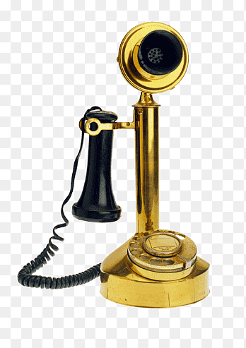

{}

Since questioned-speaker recordings are often telephone recordings and traditional telephone systems have bandpasses of around 300 Hz – 3.4 kHz, first formant (F1) frequencies close to 300 Hz (e.g., in [i] and [u]) are often distorted, and high frequency spectral information in bursts and fricatives (e.g., in [th] and [s]) is often missing. 

Once they have made their measurements, some practitioners make tables or plots of the values, and use their training and experience to subjectively assess strength of evidence via examination of those tables or plots. For example, first versus second formant (F1-F2) values could be plotted for realizations of a particular vowel phoneme in both the known- and questioned-speaker recording, and the visual degree of overlap considered. Measurements made on recordings of foil speakers may also be plotted.

---

## Timing catagories in speech acoustic 

* Fastest changes: temporal fine structure 
* Medium changes: periodicity 
* Slowest changes: envelop 

---

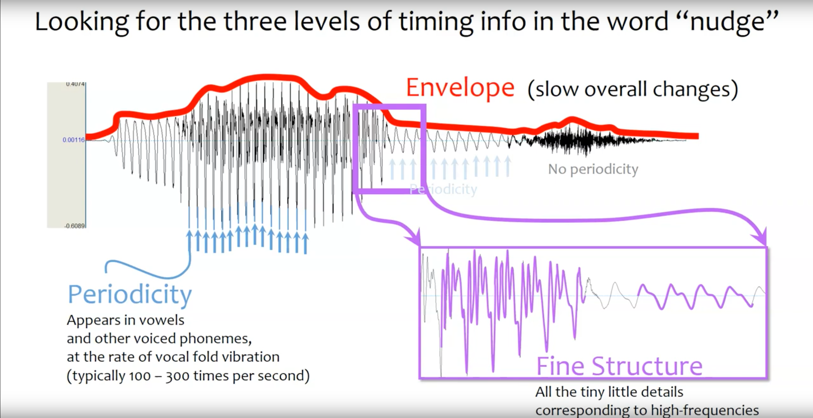

---

## Envelope - shows stressed syllables

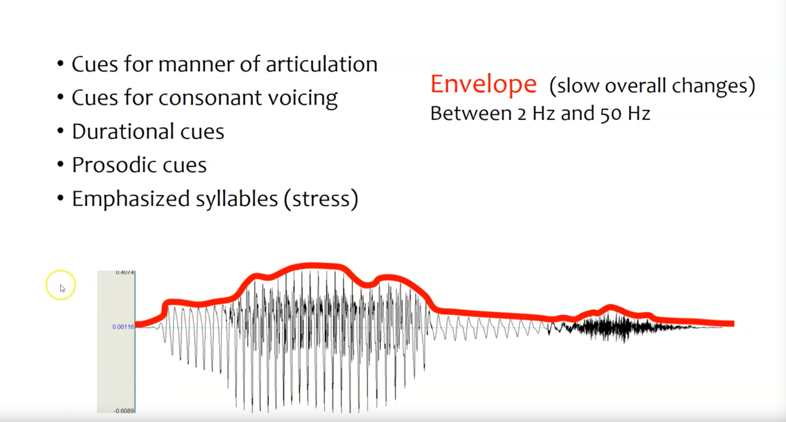

---

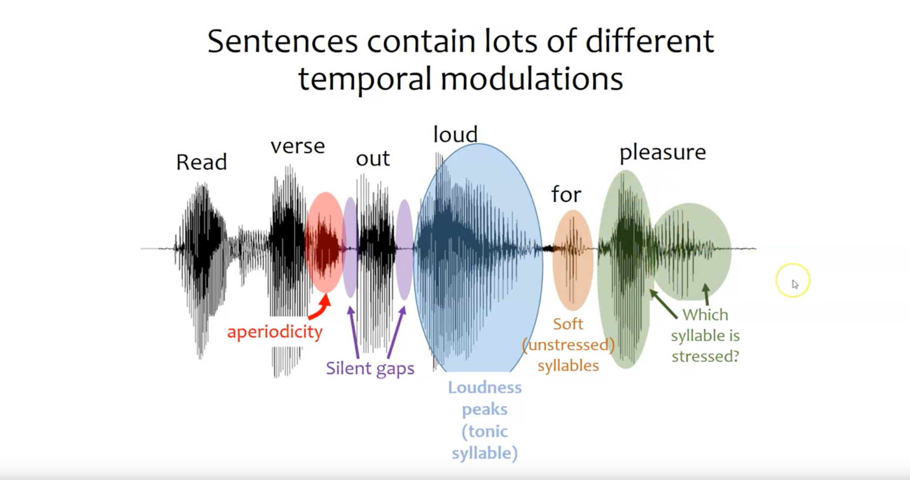

---

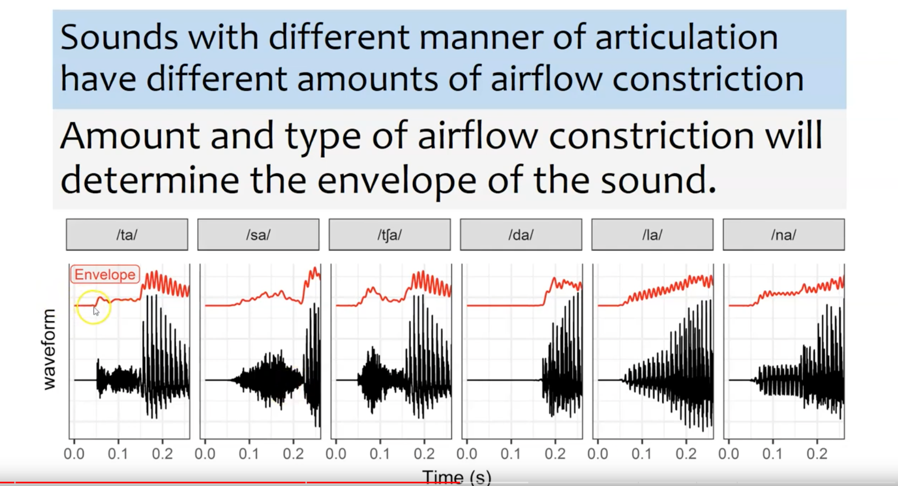

---

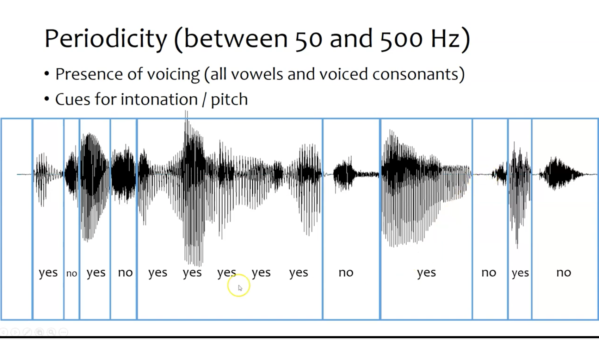

{}

* Periodicity for the yes words, also louder 
    * also known as voiced sounds 
* non periodicity for the no words

---

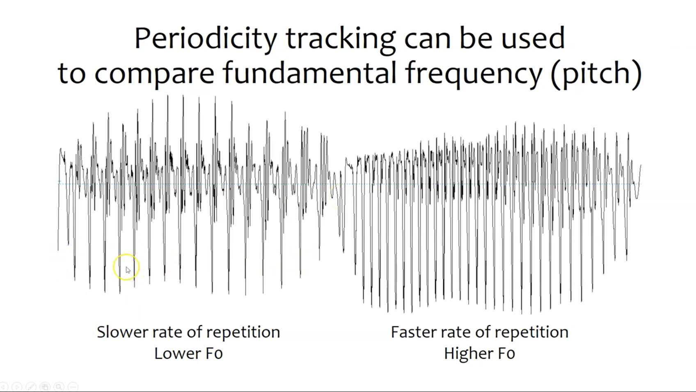

{}
We can at least see that the signal on the right has a higher frequency than the signal on the left 

---

## Source-filter model 

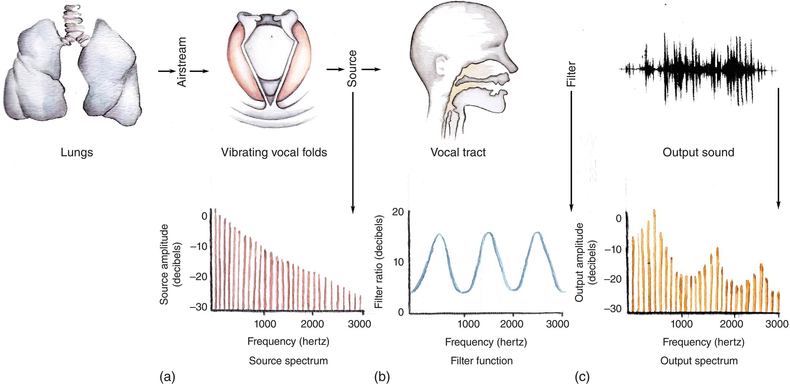

{}
Here's a basic model for how our vocal tract works.

---

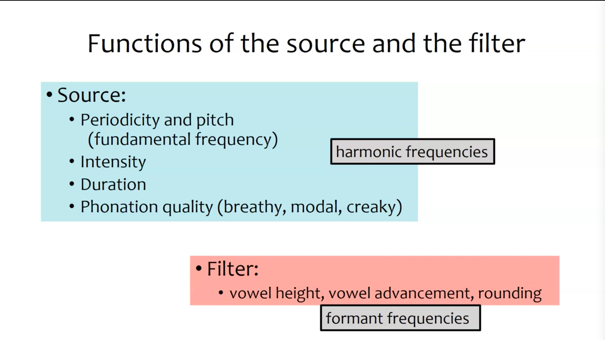

{}
The source is responsible for harmonic frequencies, the filter is responsible for formant frequencies.

---

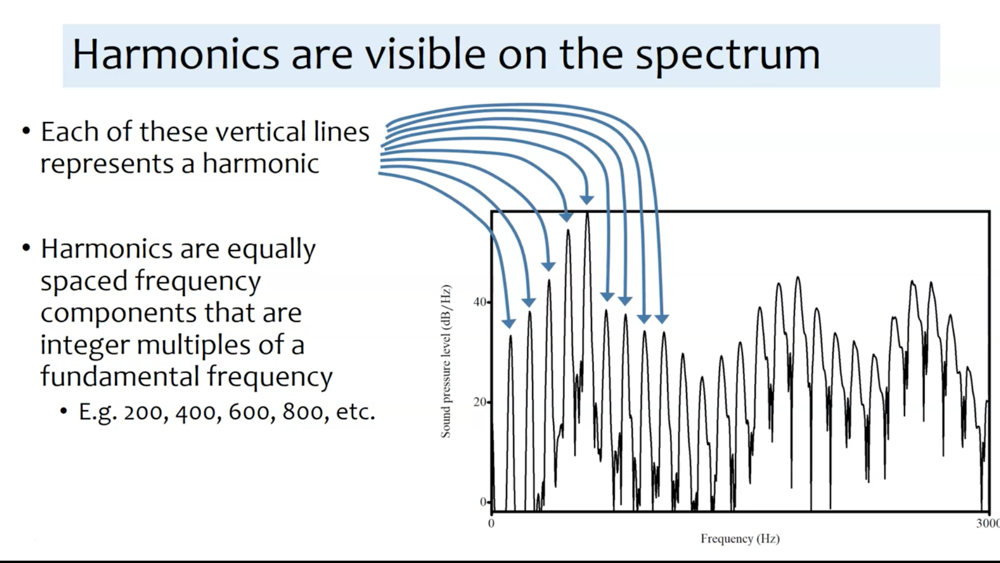

---

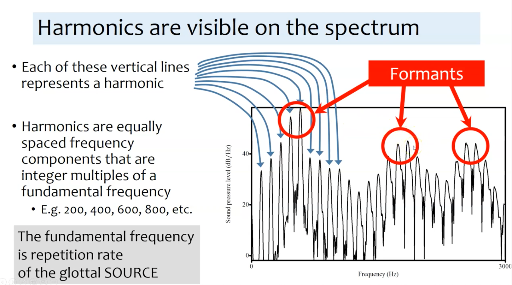

{}
Here we can see the first three formant frequencies. 

---

## Interactive vocal tract 

[Here](https://dood.al/pinktrombone/)