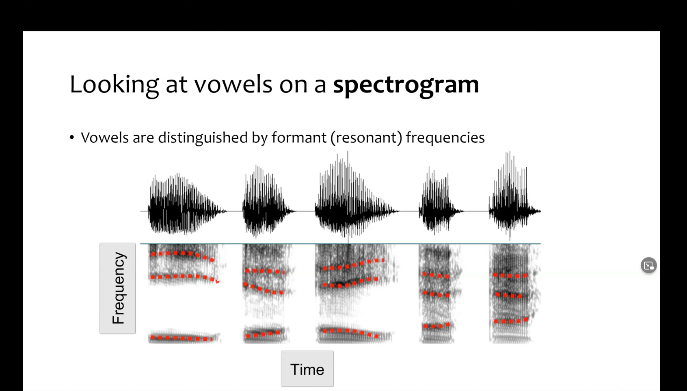
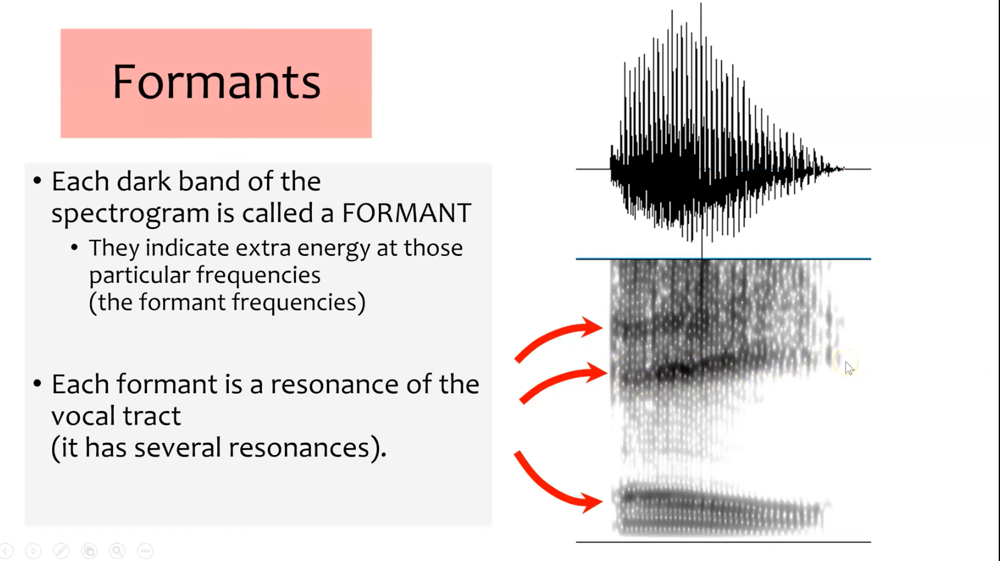

+++
title = "Formants"
outputs = ["Reveal"]
[reveal_hugo]
theme = "solarized"
# show_notes = "separate-page"
+++

---

{}
Show some vowel formants in Praat now. Show the difference in shapes between different vowels.  