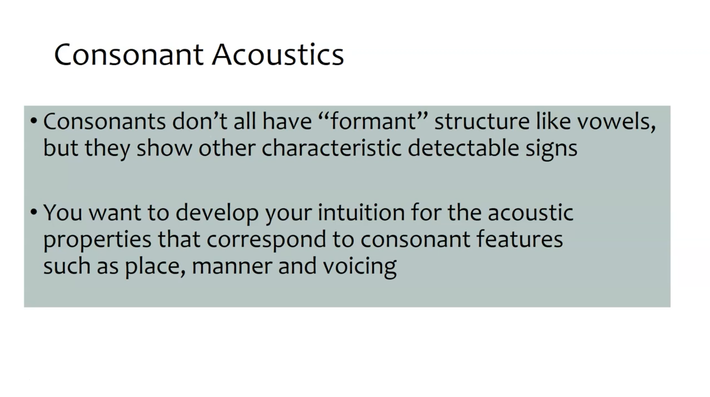
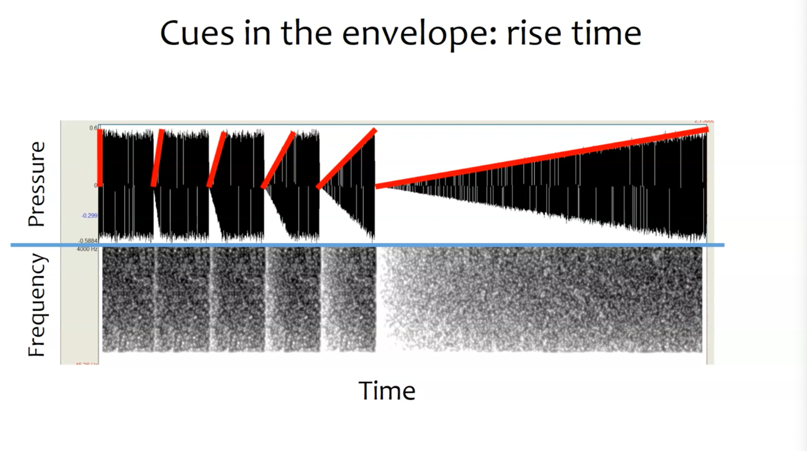
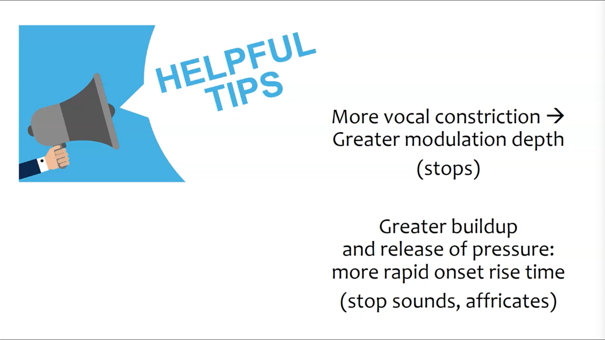
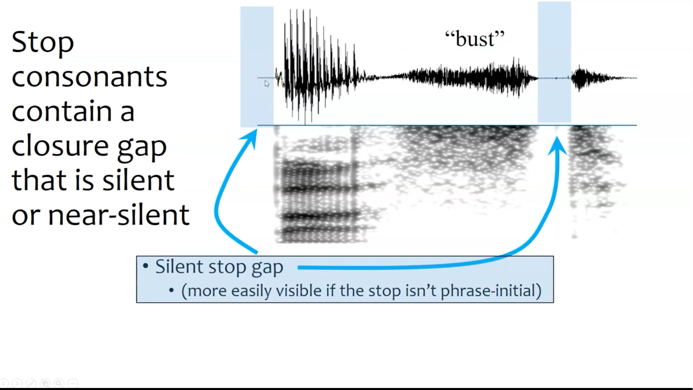
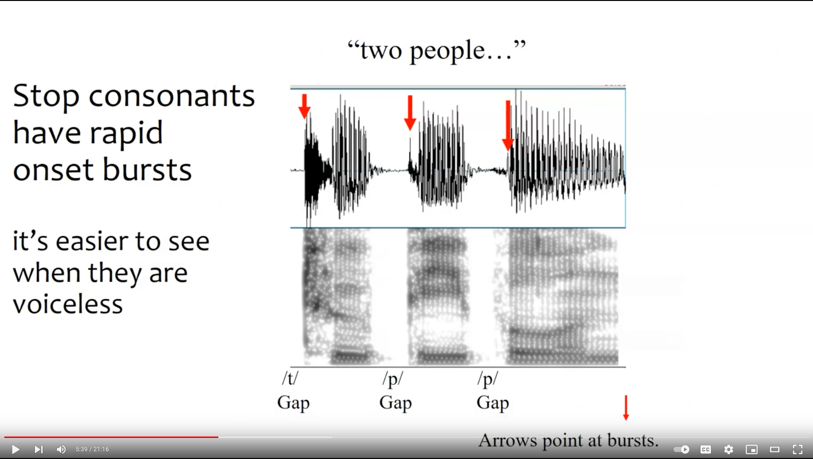
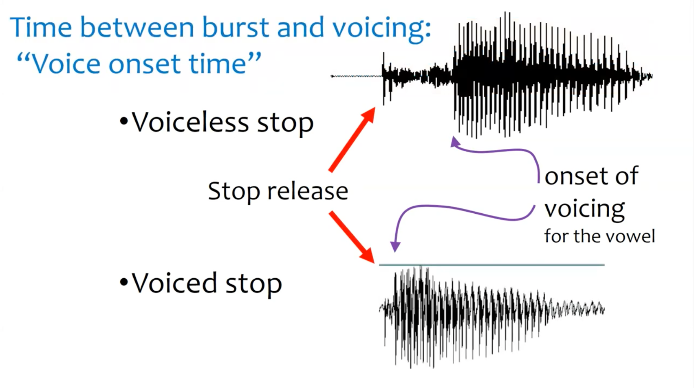
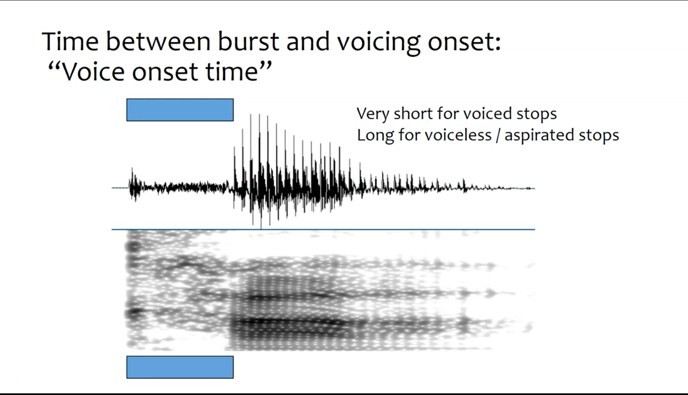
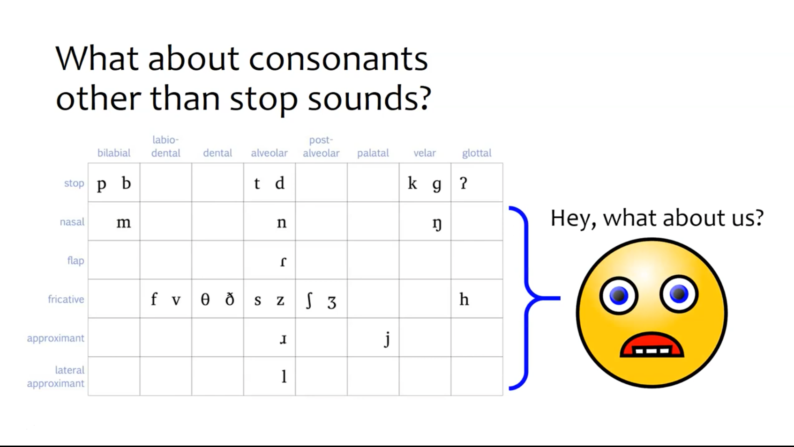
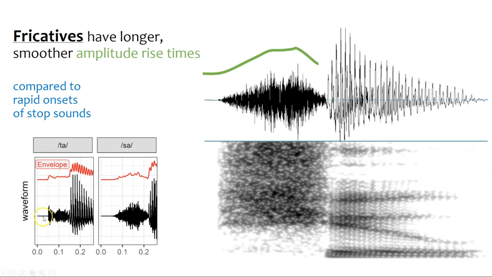

+++
title = "Consonants"
outputs = ["Reveal"]
[reveal_hugo]
theme = "solarized"
# show_notes = "separate-page"
+++

---

{}
This envelope shape is known as the rise time. How long does it take to go from silence to the peak of the sound?

We can also kep in mind modulating waveforms that have a variety of speeds and amplitudes. We should already have an idea of what this sounds like. 

---

{}
More vocal tract constriction lead to a greater modulation depth. 

---

{}
In phonetics, a stop consonant is the sound made by completely blocking the flow of air and then releasing it. Also known as a plosive. 

Blocking the airflow here is known as constriction and is done with the tongue and throat.

Some examples are /p/, /t/, and /k/. Pa, te, and ka. These sounds are made with different parts of the vocal tract, linguists call these places of articulation.

Experiment with recording this sound then take out the silence. Is the sound still intelligible?

---

{}
Another property of stopped consonants is these rapid onset bursts that occur at the beginning of the sound.

---

{}
Another property of consonants is voice onset time, the time between these onset bursts and the voicing of the sound. 

---

---

{}    

There are other consonant sounds. 

---

{}

We can compare stopped consonants /ta/ to the fricative /sa/. See the longer amplitude rise time in /sa/ as compared to /ta/. 