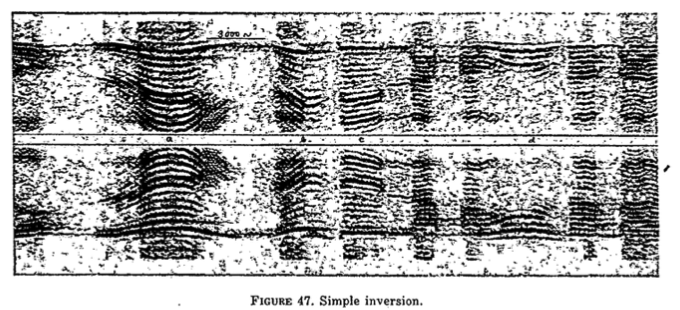

+++
title = "Forensic Audio"
outputs = ["Reveal"]
[reveal_hugo]
theme = "solarized"
# show_notes = "separate-page"
+++

# Audio forensics' beginnings

---

## We need

* a means to capture and playback sound
* a means to edit sound
* a means to analyze sound

{}
Digital data, and particularly compressed formats, mean every mobile phone is now capable of recording, in both standalone audio and as a stream within a video file. There are also numerous recorders (both portable and system-based) for capture in various forms, from telephone call recordings systems through to domestic doorbells with built-in surveillance. As the majority of people in the western world own mobile phones, they are, by design, carrying devices capable of the recording and playback of the sound at all times.

The editing of digital recordings is not only straightforward due to its binary format, but the software to perform such tasks is available free of charge, and in some cases even comes included as standard within recording software, enabling anybody with a minimal level of skill and understanding of audio to perform an edit. It also allows the enhancement of audio to be performed by manipulating the binary digits using digital signal processing methods.

Since the spectrogram and the first audio forensics cases, an increasing number of analyses have become available, thanks to research performed and presented by universities, law enforcement agencies, and software development companies around the world. Although analyses were available during the analogue era, the digital age allows data to be easily, quickly, and effectively processed, and a myriad of methods exist to extract pertinent data from a recording for analysis.
{{/ note %}}

---

## The Spectrogram 

{}
Audio recordings provided the ability to do some sort of analysis on sound, but it wasn't until the spectrogram was invented that the analysis became more useful. 

 According to one report, the spectrogram was first demonstrated to National Defense Research Committee (NDRC) representatives in 1941, resulting in Project C-43 being organised to provide a spectrogram to decipher speech and sounds visually, although the top priority was the study of encryption and decryption of confidential voice transmissions (National Defense Research Committee, 1944a). The type of encryption used was known as speech scrambling, something which was achieved using a variety of methods (National Defense Research Committee, 1942, 1944b, 1946BIB-023 )

Once the war was over, a company called Kay Electric was licensed by Bell Labs to develop and manufacture a commercial version of the spectrogram, named the Sono-graph. The device, released in 1951, provided a tool for the visual analysis of recordings, and as such, was an obvious choice of tool for use in audio forensics (Vale, 2019).

{{/ note %}}

---

## United States v. McKeever (1958)

{}
The first time a criminal case had an audio recording presented as evidence. A recording was actually a core piece of evidence.  According to court documentation, the defence attempted to impeach evidence from a prosecution witness named George Ball, by claiming he was giving inconsistent evidence, based on earlier recordings made by the defendant of conversations between himself and the witness. George Ball did not recall the discussions, so was permitted by the judge to listen to the recordings on headphones during open court to refresh his memory. Once this listening session had concluded, he stated that he did in fact now remember the conversation, but he did not recognise his own voice and could not remember whether the recording was of the entire conversation. The defence argued that as he recalled the discussion, there should be no need to provide evidence relating to the authenticity of the recording. Unsurprisingly, the prosecution argued that as he did not recognise his own voice and could not recall whether it was the entire conversation, the defence should be required to provide evidence of the accuracy and authenticity of the recording. After reviewing precedents set by other cases, the judge ruled that before an audio recording could be admitted as evidence, its authenticity must be established by providing proof of the following
{{/ note %}}

---

## Seven Tenets of Audio Authenticity 

1. The recording device was capable of capturing the conversation now offered in evidence. 
2. The operator of the device was competent to operate the device. 
3. The recording is authentic and correct.
4. Changes, additions, or deletions have not been made in the recording.
5. The recording has been preserved in a manner that is shown to the court.
6. The speakers are identified.
7. The conversation elicited was made voluntarily and in good faith, without any kind of inducement.

{}
These are known as the Seven Tenets of Audio Authenticity 

The evidence that was admissable was actually a transcript of the recording rather than the recording itself. This case propelled the FBI to start training its own audio forensics experts. 

{{/ note %}}
