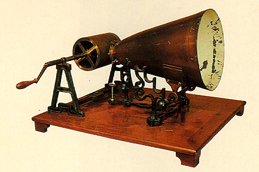
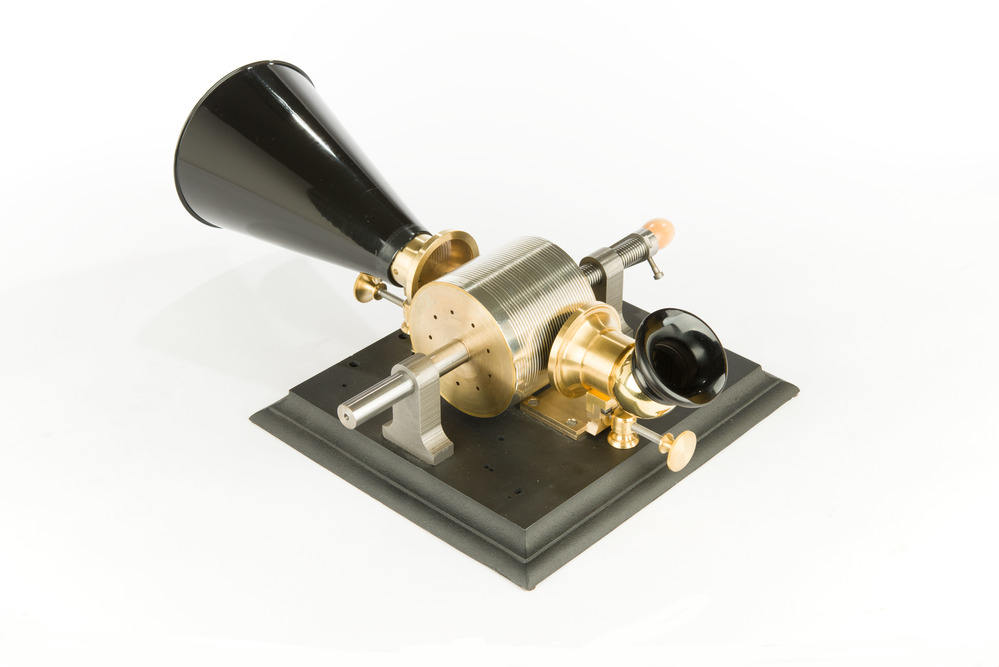

+++
title = "Forensic Audio"
outputs = ["Reveal"]
[reveal_hugo]
theme = "solarized"
+++

# History of Audio Forensics

---

# Technological develoments

## The analogue years

{}
The history of audio forensics is a history of audio technology.
{{/note %}}

---

### Edouard-Léon Scott de Martinville's Phonautograph

Hear the [sounds](http://www.firstsounds.org/sounds/scott.php)

{}
Thomas Edison is widely regarded as a pioneer in the field of audio creating the first method of recording. Edison’s phonograph was the first machine to both record sounds and play them back. 

But actually the first capture of sound is documented as the 10-second recording of a folk singer on the 9th of April 1860, in France. he device was named the Phonoautograph and consisted of a barrel-shaped horn attached to a stylus. The movement of the horn, and thus, the stylus, etched sound waves onto sheets of blackened paper which had previously been exposed to oil lamp smoke. Designed by Parisian Edouard-Léon Scott de Martinville, it was his intention to capture a visual representation of human speech that could be deciphered at a later date (Brock- Nannestad and Fontaine, 2008), and for around 150 years the sounds remained trapped on the blackened paper But with new technology comes new solutions, and in 2008 scientists at the Lawrence Berkeley National Laboratory in California, USA, used optical imaging on the high-resolution scans of the captures, and the first recorded sound was finally replayed (Rosen, 2008).

{{/note %}}

---

<iframe name="Smithsonian Voyager" src="https://3d-api.si.edu/voyager/3d_package:b94613aa-d27e-4387-b2d3-0e3f09dcb433" width="800" height="450" allow="xr; xr-spatial-tracking; fullscreen"></iframe>

{}
14th of February 1876, when Alexander Graham Bell, in his laboratory in Boston, MA, used a diaphragm attached to an electromagnet to act as a transducer and convert acoustic waveforms hitting the diaphragm into electrical variations. The speech was extremely faint, but audible none the less (Clark, 1993). He called his new device the ‘telephone’ after the word ‘telephony’ (which was already an established term by this time). 
{}

---

### Edison's phonograph

[Listen](https://archive.org/search.php?query=creator%3A%22Thomas+Alva+Edison%22) to some of the recordings

{}

A year later and upon hearing of Bell’s device, Thomas Edison took this idea one step further with the intention of transmitting messages using this new technique. Using a stylus attached to the telephone microphone, he was able to create grooves representative of the movement of the sound waves on paraffin- coated paper by using an electromagnetic as a transducer (Figure 2.1). He discovered that reversing this process by running the stylus over the grooves moved the connected electromagnet, and thus the diaphragm. The diaphragm movement then moved the surrounding particles of air, reproducing the previously captured sound waves of the nursery rhyme ‘Mary had a little lamb.’ He named his device the ‘Phonograph’ (Bouchard, 2012; Wile, 1982). The concept of reversing the capture process for playback remains the foundation of all audio systems to this day.

Photos of a replica 1877 cylinder tinfoil phonograph: Invented by Thomas Edison and built by John Kruesi in Menlo Park, New Jersey in December 1877. This machine is a replica, built by William Miller in 2011. It is based on the original artifact, which is preserved at Thomas Edison National Historical Park. The replica mouthpiece, built in 2017 by Anton Stoelwinder, and replica horn are based on historic drawings. 
{{/note %}}

---

<iframe width="560" height="315" src="https://www.youtube.com/embed/wRTgl0qx6wE" title="YouTube video player" frameborder="0" allow="accelerometer; autoplay; clipboard-write; encrypted-media; gyroscope; picture-in-picture" allowfullscreen></iframe>