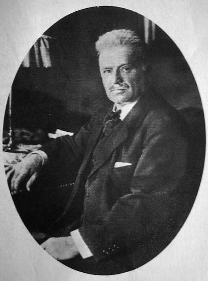
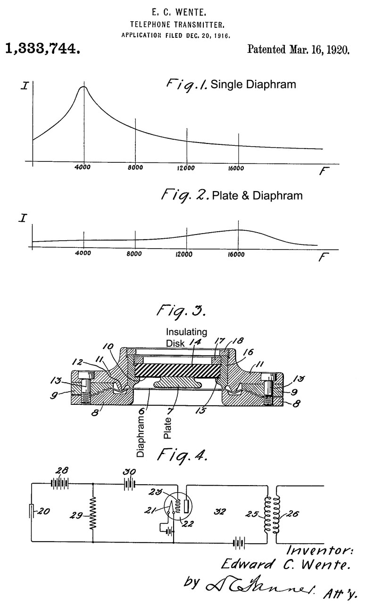
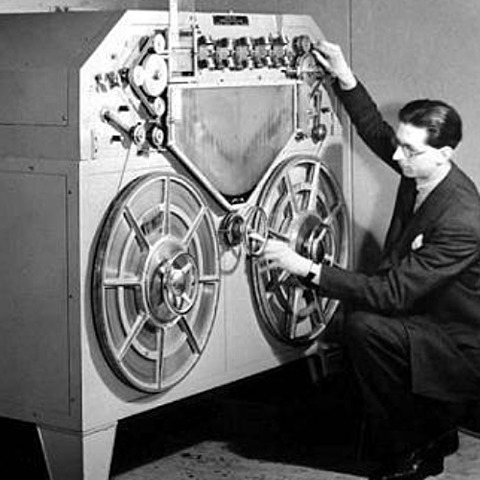
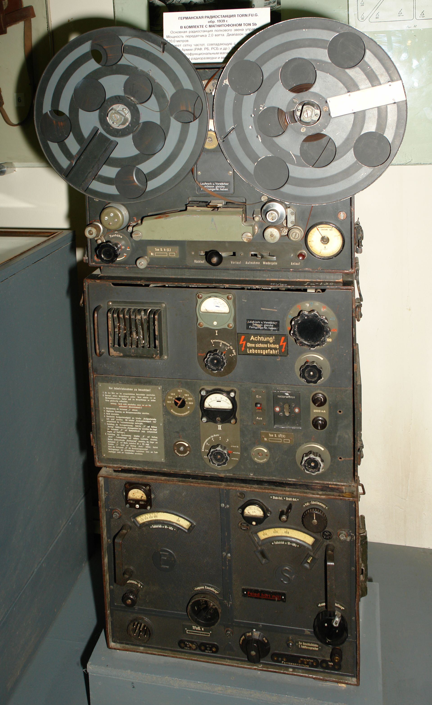
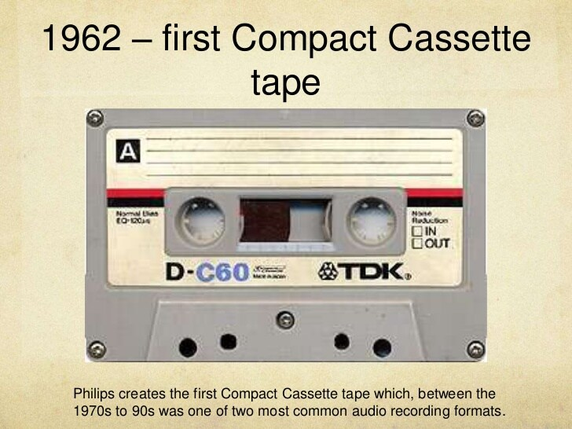
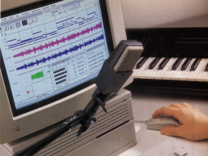

+++
title = "Forensic Audio"
outputs = ["Reveal"]
[reveal_hugo]
theme = "solarized"
# show_notes = "separate-page"
+++

# History of Audio Forensics

---

# Technological developments

## The analogue years

{}
The history of audio forensics is a history of audio technology.
{{/note %}}

---

### Edouard-Léon Scott de Martinville's Phonautograph - 1860

Hear the [sounds](http://www.firstsounds.org/sounds/scott.php)

{}
Thomas Edison is widely regarded as a pioneer in the field of audio creating the first method of recording. Edison’s phonograph was the first machine to both record sounds and play them back. 

But actually the first capture of sound is documented as the 10-second recording of a folk singer on the 9th of April 1860, in France. he device was named the Phonoautograph and consisted of a barrel-shaped horn attached to a stylus. The movement of the horn, and thus, the stylus, etched sound waves onto sheets of blackened paper which had previously been exposed to oil lamp smoke. Designed by Parisian Edouard-Léon Scott de Martinville, it was his intention to capture a visual representation of human speech that could be deciphered at a later date (Brock- Nannestad and Fontaine, 2008), and for around 150 years the sounds remained trapped on the blackened paper But with new technology comes new solutions, and in 2008 scientists at the Lawrence Berkeley National Laboratory in California, USA, used optical imaging on the high-resolution scans of the captures, and the first recorded sound was finally replayed (Rosen, 2008).

{{/note %}}

---

<iframe name="Smithsonian Voyager" src="https://3d-api.si.edu/voyager/3d_package:b94613aa-d27e-4387-b2d3-0e3f09dcb433" width="800" height="450" allow="xr; xr-spatial-tracking; fullscreen"></iframe>

{}
14th of February 1876, when Alexander Graham Bell, in his laboratory in Boston, MA, used a diaphragm attached to an electromagnet to act as a transducer and convert acoustic waveforms hitting the diaphragm into electrical variations. The speech was extremely faint, but audible none the less (Clark, 1993). He called his new device the ‘telephone’ after the word ‘telephony’ (which was already an established term by this time). 
{}

---

### Edison's phonograph - 1877

[Listen](https://archive.org/search.php?query=creator%3A%22Thomas+Alva+Edison%22) to some of the recordings

{}

A year later and upon hearing of Bell’s device, Thomas Edison took this idea one step further with the intention of transmitting messages using this new technique. Using a stylus attached to the telephone microphone, he was able to create grooves representative of the movement of the sound waves on paraffin- coated paper by using an electromagnetic as a transducer (Figure 2.1). He discovered that reversing this process by running the stylus over the grooves moved the connected electromagnet, and thus the diaphragm. The diaphragm movement then moved the surrounding particles of air, reproducing the previously captured sound waves of the nursery rhyme ‘Mary had a little lamb.’ He named his device the ‘Phonograph’ (Bouchard, 2012; Wile, 1982). The concept of reversing the capture process for playback remains the foundation of all audio systems to this day.

Photos of a replica 1877 cylinder tinfoil phonograph: Invented by Thomas Edison and built by John Kruesi in Menlo Park, New Jersey in December 1877. This machine is a replica, built by William Miller in 2011. It is based on the original artifact, which is preserved at Thomas Edison National Historical Park. The replica mouthpiece, built in 2017 by Anton Stoelwinder, and replica horn are based on historic drawings. 
{{/note %}}

---

<iframe width="560" height="315" src="https://www.youtube.com/embed/wRTgl0qx6wE" title="YouTube video player" frameborder="0" allow="accelerometer; autoplay; clipboard-write; encrypted-media; gyroscope; picture-in-picture" allowfullscreen></iframe>

---

## Graphophone - 1886 - Bell

{}
Improving on the work of edison  Bell picked up on the work of his rival and swapped the stylus for a chisel-shaped cutter to leave deeper, and thus cleaner grooves. This resulted in a more intelligible sound with lower background noise. He named his device the ‘Graphophone’ in his 1886 patent (Newville, 1959).

{}

---

## Gramophone - 1898 - Edison 

<iframe width="560" height="315" src="https://www.youtube.com/embed/d8UE4R_5o9c" title="YouTube video player" frameborder="0" allow="accelerometer; autoplay; clipboard-write; encrypted-media; gyroscope; picture-in-picture" allowfullscreen></iframe>

{}
Edison didn't want to work with Bell, so he decided to create his own cylinder phonograph. This time he decided to use electric motor- driven disks instead of the hand-cranked rotating cylinder he had used previously for movement of the paraffin-coated material and he named his new 1898 device the ‘Gramophone’ (Collins and Gitelman, 2002).

{}

---

## Valdemar Poulsen - 1900

{}
 described the separation of the carrier from the memory coating in a flat information medium in a 1900 patent, an observation which went on to form the basis of magnetic tape (Poulsen, 1900). He also recognised that the signal captured on a tape does not correspond to the recording current but is distorted, and in 1907 he proposed the addition of a DC current to the signal, a technique known as ‘biasing.’ 

{}

---

## E.C. Wente - Bell Telephone Labs

{}
E.C. Wente, of Bell Telephone Labs, published a research article (Wente, 1917) describing a uniforming sensitive instrument for the ‘absolute measurement of sound intensity,’ named ‘the condenser microphone.’ Although initially designed for long-line telephone transmission during the USA’s development of a transcontinental telephone service, its remarkable acoustic performance lent it to the recording process (Mayfield and Harrison, 1926).

{}

---

## Fritz Pfleumer - Magnetic Tape - 1928

{}

one of the first machines that could be used with magnetic tape was developed by Fritz Pfleumer, in which paper coated with steel shavings served as the storage method. This brought in the potential for looping, splicing, and erasing of audio content for the first time in the history of recording.

{}

---

## Magnetophon - 1940s 

{}
By the 1940s, this technology was finding some use in the military due to contracts issued by the Naval Research & Development Department. While the Allies used magnetic tapes during the Second World War, Hitler’s demand for audio to be replayed for propaganda purposes meant Germany continued its research into the field. This led the German company AEG to develop a tape using paper or acetate covered with a fine layer of brown iron oxide, a method which was to go on to become the future of magnetic recording (Engel and Hammar, 2006). It wasn’t until the final months of the war that this invention was discovered, and once the war was over, the US took two Magnetophon machines back to a laboratory and performed reverse engineering to recreate their own versions (Audio Engineering Society, 2014).
{}

---

## Cassette Tape - Philips - 1962

{}
The ideas taken from these dictating machines resulted in Philips developing the cassette tape in 1962, followed closely by the compact cassette tape in 1963. The offer of licensing the technology to other companies combined with low production costs and a modest sound quality helped it become a standard format by the end of the 1960s (Nijsen, 1983). That being said, there was still an issue with the sound quality compared to vinyl due to tape hiss, but it could match larger reel-to-reel recorders in frequency response, dynamics, and distortion. To address this problem, Ray Dolby (who was working at the Ampex Corporation at the time, but went on to start the now renowned Dolby Digital) created a noise reduction system for cassette tapes. This system, known as ‘Dolby Type A’ (Dolby, 1967), allowed high fidelity tapes to become possible.
{}

---

# The digital years

{}
although the digital transformation of sound was first attempted by the early telephone companies to enable more messages to be transmitted per wire, and despite experiments by laboratories in the 1930s with Pulse Code Modulation (PCM), based on earlier research (Nyquist, 1928), the technology didn’t become available until the early 1980s. 

to summarize!! 

In short, Edison’s phonograph stored sound waves as a soft groove on a cylinder. Western Electrical’s recorder converted sound into varying voltages of electric current, which could then be converted into a wave in a groove, or stored on a tape in which varying levels of magnetism represented the varying electrical current. Digital recording turned sound waves into pulsating electric currents that can be measured and expressed as a binary code of digits.
{}

---

## Pulse Code Modulation (PCM) - 1930s

{}
* Published in 1928, the Nyquist Theorem proposed that it is possible to convert a continuous signal into one which is discrete, and then reconstruct this back into a continuous signal without any data loss.
* three decades later, Bell Labs had the first PCM transmission system in their lab, while Japanese companies experimented with the storage of PCM values on a plastic disc, before later using a laser (another Second World War invention) to read and playback the values of sound (Iwasawa and Sato, 1977).
{}

---

## Compact Discs - 1980s

{}
although PCM was a leap forward, there were still problems relating to the storage of the data. The solution arrived in the computers of the early 1980s as they could easily store this data on hard drives in binary digits. A second solution was the digital audio disc, developed in 1979 through a working partnership between the Philips and Sony organisations. It was named the ‘Compact Disc’ or CD, taking its name from the earlier compact cassettes for which both companies had worked so hard to establish as a standard format (Immink, 1998).
{}

---

## Sound Tools - 1989

{}
The first Digital Audio Workstation, finally allowed editing with a graphical interface. Editing was done on a digital audio tape, or DAT. 

Later in the 90s CDs players were common in home computers bringing digital audio to anyone. 
{}