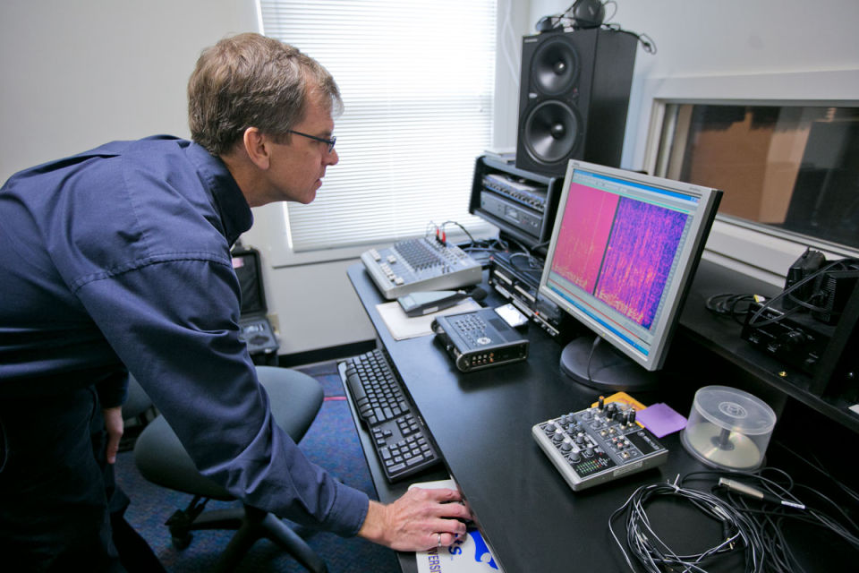
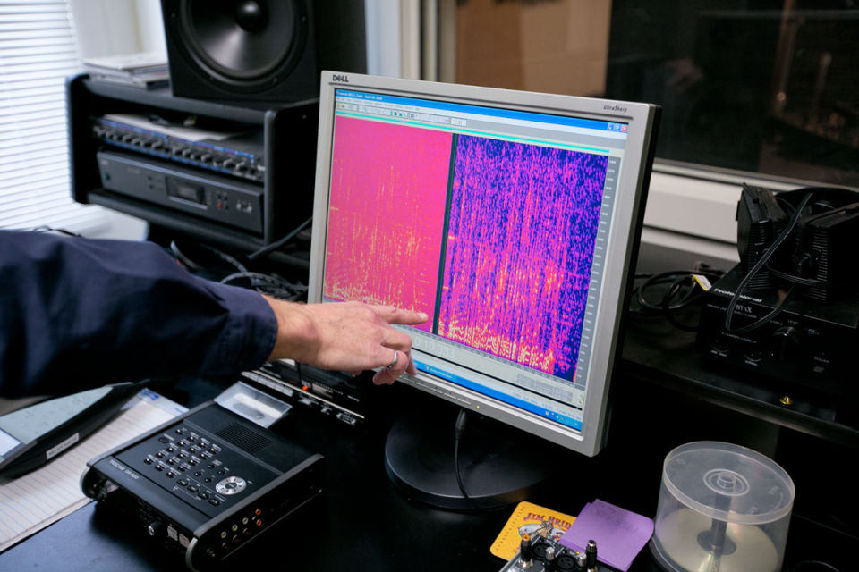

+++
title = "Forensic Lab Setup"
outputs = ["Reveal"]
[reveal_hugo]
theme = "solarized"
# show_notes = "separate-page"
+++

# The forensic laboratory set-up

{}
two core requirements:
(1) the mitigation of issues which may reduce the accuracy, reliability, and objective nature of the work; and (2) the need for various audio-related tools to allow the laboratory to perform a range of examinations.

mix between a classic forensic lab and a recording studio 

---

## Environment 

{}
Areas of concern: 
* mitigation of noise
    * Because the recordings are already noisy one must make sure that no noise is introduced when making the analysis. 
    * an ideal space would be away from sources of noise, such as main roads, HVAC (heating, ventilation, air conditioning) systems or shared offices
    * Think of what a recording studio might do, this is not always so financially practical for a lab. 
* Preservation of evidence - free from 
    * damp or moisture
    * hardware with magnets near harddrives - store evidence in a separate room
* Physical security of area
    * doors with access control systems to know who has been in and out of the lab 
    * also visitor logs as a paper trail
    * digital security - firewalls, password changes, and virus scans  

---

## Workstation 

{}
* 3 months of evidence should be stored on the workstation at any given time
* after that data can be store in an offsite location
* Multiple monitors are good and high definition helps 
* for certain types of work air gaped systems will be necessary; this will more greatly ensure the safety of the data

---

## Software 

* Hex editor/viewer 
* Audio enhancement software 
* Word processor 
* Case management system
* Metadata reader
* Audio conversion software 
* Audio analysis software

{}
The benefit of having the latest software is of less importance than the stability and predictability of results. Before updates are performed, a review of the reason for the update should be performed, and verification testing completed to ensure the software functions as expected before its application to casework.
A list of all software versions and the dates of updates must also be documented to ensure only those which have been validated and verified are used, and periodic verification is performed based on the dates stored within the log.

---

## Audio Equipment

* Headphones
* Audio interface

{}
First, the headphones. Closed-back, over-the-ear designs trap the sound output from the headphones, prevent external sounds from entering the ear canal, and prevent reverberation, all of which reduce the possibility of any misrepresentation of the audio output due to the acoustics of the listening environment. This is essential for ensuring tasks such as critical listening and transcribing can be performed in optimal conditions. A built-in limiter would also be desirable to prevent loud transients which have the potential to damage hearing, and the frequency response should be as flat as possible to avoid regions being attenuated and boosted which may colour the sound (Bergfeld and Junte, 2017). It is better to control the frequency response by using a pair with a flat frequency response and apply boosts and cuts from within the workstation than listen to a signal which has a frequency response coloured by the speakers. Most headphones designed for commercial use by the general public will not have a flat frequency response as their primary task is to sound ‘good,’ which means their representation of the material is not necessarily accurate.

Second, a sound interface with a number of inputs and high-quality ADC and DAC converters. Conversion to the digital domain is required in instances where there is no digital access to recordings stored on a device, and so an analogue signal must be sent to an input on the interface. This is becoming less of a necessity as devices with various digital interfacing options, such as removable memory cards, wi-fi connections, and direct cable transfer become more common. Capture through analogue means is not ideal, but does happen on occasion. The interface similarly requires a high-quality DAC for output to the headphones.

---

## Other Devices

* Hardware write-blocker
* Portable audio recorders
* Cassette tape player
* External hard drives
* Printer
* DVD reader/writer
* SD card reader

{}
* Hardware write-blocker. Used to ensure evidence on original devices remains unchanged when being imaged to a workstation.
* Portable audio recorders. Essential for the creation of reference recordings relating to casework.
* Cassette tape player. Although not crucial, they can be required when the conversion from an analogue tape is needed.
* External hard drives. For backing up data, a minimum of two hard drives per back-up should be used to ensure that if one is damaged, the data remains stored on the other.
* Printer. For printing reports and other documentation in preparation for courtroom testimony.
* DVD reader/writer. For reading exhibits provided in a CD/DVD format and burning enhancements to data DVDs where required.
* SD card reader. For reading exhibits provided in an SD card format.

---

## Documentation 

### Repeatability x Reducibility = Reliability.

{}
All scientific methodologies should be both repeatable and reproducible within a predefined error rate.
* repeatability - same scientist getting the same results
* reproducibility - different scientist getting the same results 
* Notes must be taken of each action taken in order to ensure repeatability and reproducibility.
    * can be exhibit logs, word processed documents, or screenshots 
    * should also list software used 
* vital for: 
    *  When a report is served to an opposing expert, it allows them to review the work undertaken and opine on whether they agree or disagree with the methodology and any conclusions reached.
    * If further action is required, it aids the examiner as they can review notes and pick up where they left off.
    * If additional work is required and the examiner who performed the work is unavailable, a second examiner can review the primary examiner’s notes before continuing the work.
    * More often than not, the actual forensic work will be performed months in advance of a trial. Recalling the processes performed while giving evidence would be both stressful and unreliable if notes have not been taken at each stage.
    * If an opposing expert uses the same tools but obtains different results, the reasons for such can be easily determined (for example, different versions of the same software, different versions of a recording).

---

## Sequence of documentation 

* Exhibit log 
* Working notes 
* Peer review

{}

* Exhibit log
    * Documentation concerning the exhibit received, regardless of whether it is a digital or physical exhibit. This may include but is not limited to: case reference, date received, method of delivery, format (digital/physical), filenames, and hash checksum of data.
* Working notes
    * These should consist of, at minimum, the following: case reference, examiner, date of analysis, results of any preliminary analysis, proposed steps, software versions used (including the operating system), the hardware used, processing applied, any opinions, and the set of premises on which these opinions are based.
* Peer review
    * Once an examiner has completed a report relating to an examination, it is peer-reviewed by another expert trained to a specific level of competency. Notes are then made by the reviewer, either digitally or physically, and provided for the examiner to consider before amending the original report where necessary. These considerations will range from terminology and grammar, the analysis performed, conclusions reached, and any legal necessities in relation to the work performed.
    * Although this may seem like a lot of documentation, there are methods to reduce it while still ensuring the same level of detail and thus, reliability. One example with regards to audio enhancements is to export the settings and processes applied from the software used. Not all programs include this feature, but if available, it is an option as it is simple and effective in ensuring the processes applied are documented accurately.