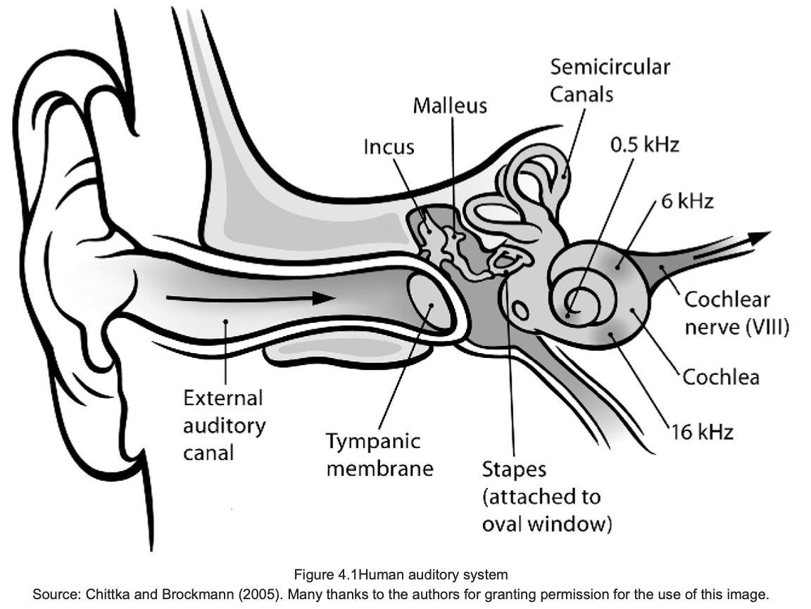
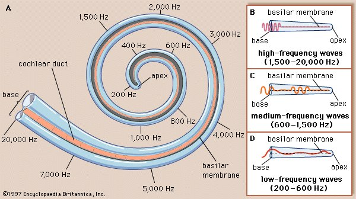
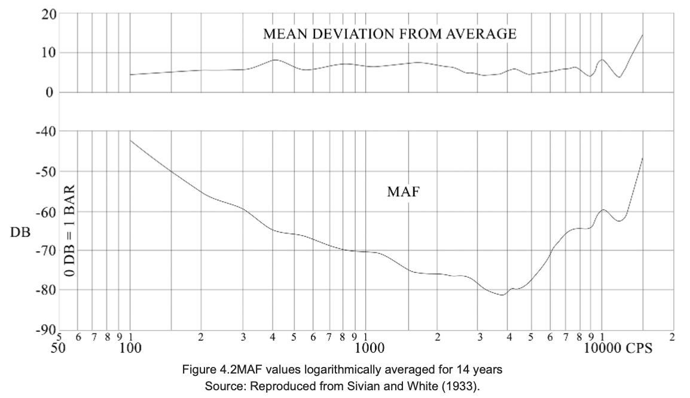
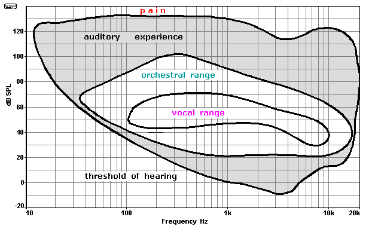
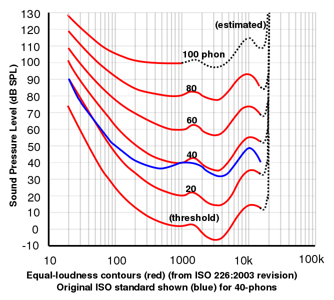
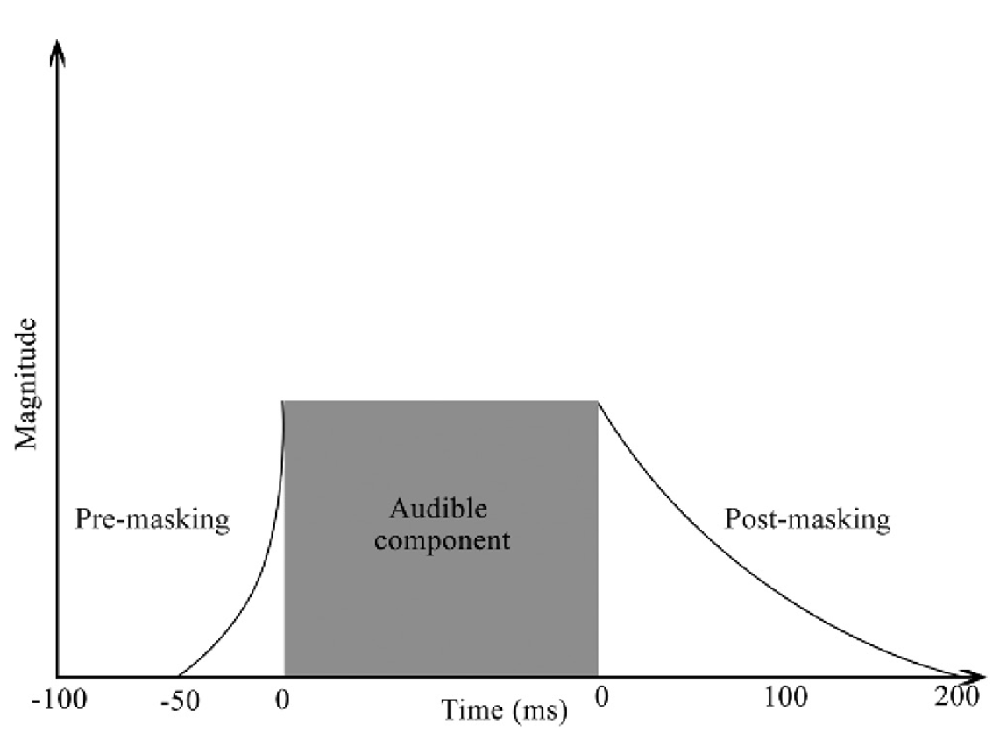

+++
title = "The human auditory system"
outputs = ["Reveal"]
[reveal_hugo]
theme = "solarized"
# show_notes = "separate-page"
+++

# The human auditory system

{}

It is important to know about the human auditory system's limitations in perceiving sound. We hear in a specific frequency and loudness range. Also we can be confused to masking. 

---

 

 {}
Lets start with the ear! 

* Outer ear = pinna or this flap right here. Its shape has two functions:  
    * to provide spatial information 
    * to funnel sound towards the auditory canal as well as amplify 
* Middle ear - tympanic cavity
    * Tympanic membrane aka eardrum - divides the outer ear and the middle ear. 
    * sound is conducted by ossicles - the malleus, incus and stapes (or hammer, anvil and stirrup)

---

{}
* Inner ear
    *  Cochlea. This contains the nerves for hearing. rolled up tube that has 15,500 hair cells 
         * basilar membrane -  has 3,500 sections of four hair cells each, the function of which is equivalent to a 3,500- band frequency analyser.
    *  Semicircular canals. This contains receptors for balance.

---

## Threshold of audibility

{}
* the minimum level at which a sound can be detected in the absence of other external sounds.
* measured using Minimum Audible Pressure (MAP) or the Minimum Audible Field (MAF)
* MAP measures the sound pressure level at the entrance to the ear canal, or inside the ear using a small microphone. The threshold is then defined as the level at which the listener can perceive the sound
* MAF uses loudspeakers in an anechoic chamber and measures the level at the position where the head of the subject was located when they detected a sound (Acoustical Society of America, n.d.).
* See how we are more sensitive in 100–5000 Hz region, which also happens to be the region in which the majority of human speech resides.
* This is important to know, but in the real world masking is almost always present and effects the audibility of the sound. 

---

## Frequency perception 

{}
* upper range 20 kHz - but degrades with age and is more common in children.
* lower limit is generally 20 kHz. but we feel vibrations bellow this instead of hearing them. 

--- 

## Equal loudness contours

{}
An equal-loudness contour is a measure of sound pressure level, over the frequency spectrum, for which a listener perceives a constant loudness when presented with pure steady tones.

---

Test your [hearing](http://www.phys.unsw.edu.au/jw/hearing.html)

---

## Critical bands

Try the listening test at the bottom of this [page](https://www.sfu.ca/sonic-studio-webdav/handbook/Critical_Band.html)

{}
For a given FREQUENCY, the critical band is the smallest BAND of frequencies around it which activate the same part of the BASILAR MEMBRANE. 

Essentially, these findings show that when two signals are produced which occupy the same critical band, the louder tone will ‘mask’ the quieter tone, causing it to become inaudible.

If two tones are too close, one will mask another. 

---

## Masking 

* The process by which the threshold of audibility for one sound is raised by the presence of another (masking) sound.
* The amount by which the threshold of audibility of a sound is raised by the presence of another (masking) sound, expressed in dB (American Standards Association, 1960).
* [example](https://www.sfu.ca/sonic-studio-webdav/handbook/Sound/Masking_Fountain.aiff) -- Masking effect of a fountain (at the Courthouse, Vancouver, B.C.) which increases as the recordist approaches it.

--- 

## Simultaneous masking - cocktail party effect

* [Example](https://www.sfu.ca/sonic-studio-webdav/handbook/Sound/Cocktail_Party_Effect.aiff) 

{}
The ability in perception to select one desired sound from a background of AMBIENT NOISE heard at the same time. For instance, at a party, where many voices are speaking simultaneously, we may 'focus' our ears on one voice and ignore others which are equally strong. Spatial differences in the location of the sources greatly assists this ability.

The human auditory system operates across two dimensions to isolate sound, that of the frequency domain and the time domain. This adaptation works incredibly well in a real-life environment, but once captured as an audio recording, many of these cues are lost, which is a problem for forensic audio recordings containing competing speakers.

--- 

## Cherry experiments 

* two simultaneous messages - mixed
* two simultaneous messages - unmixed 
* Also see Richard Duda [examples](https://web.mit.edu/hst.723/www/Labs/BinauralDemos.htm) - what differences in intelligibility do you hear between example? 

{}

•Two simultaneous messages, mixed. The first presented two recorded messages of varying similarity mixed together. The task put to the participants was to simply transcribe the speech, replaying the recordings as many times as they wish. The subjects reported great difficulty in accomplishing the task and errors were made, although no long phrases (over two or three words) were wrongly identified.

•Two simultaneous messages, unmixed. In this experiment, the messages were isolated and played independently into the right and left ears. It was found that participants had no problem in isolating one message and rejecting the other. In fact, the extent of rejection of the other speech was so strong that, upon being asked to recall anything heard within the message they rejected, they could provide no information about the words, the semantic content or even the language used.

Most casework will involve mixed speakers 

---

## Binaural masking 

* Binaural masking refers to differences in the signal presented at the left and right ear, although each contains both the target and masking signal.
* Also see [examples](https://web.mit.edu/hst.723/www/Labs/BinauralDemos.htm) - how many steps of tones do you hear for each example? 

{}
* Binaural masking refers to differences in the signal presented at the left and right ear, although each contains both the target and masking signal.
* Research has shown that if the phase of the target signal of a monaural signal is reversed in one ear, the detection threshold reduces by up to 15 dB (Durlach, 1963).
* In everyday life, speech is more easily understood in noise when speech and noise come from different directions, a phenomenon known as "spatial release from masking". In this situation, the speech and noise have distinct interaural time differences and interaural level differences. The time differences are produced by the differences in the length of the sound path to the two ears and the level differences are caused by the acoustic shadowing effect of the head.
* As it relates to forensics, this phenomenon demonstrates the advantages of a stereo recording over a single-channel mono recording.

---

## Informational masking

{}
Informational masking is defined as perceptual masking which occurs due to the limitations of the human auditory system, such as when the masking sound is highly similar to the desired signal, and the properties of such vary unpredictably (Pollack, 1975).

Two of the biggest causes of this effect on forensic audio recordings are competing speakers and background music. If the music contains a vocal track, effects are further compounded by the transient nature of music and similarities between voices.

In the real world (although of no use to forensic examiners), we can overcome informational masking through various cues from differing azimuth, distances, and elevation of the desired speaker and the masker. Freyman et al. (1999) showed that when speakers were separated using loudspeakers at 00 and 600 azimuths in relation to one another, there was a 15–30 per cent improvement in the keywords identified. This is compared to only a 5–10 per cent improvement when the masking speech was changed to noise of the same average spectrum.

---

## Non-simultaneous masking

{}
* masking can occur before or after a transient sound 
* Forward masking is more significant the closer in time to the masker the maskee signal occurs. * The rate of recovery is greater for maskers at higher levels, decaying after 100–200 ms.
* Increases to the masker level do not cause linear increases to the amount of masking. For example, increasing the magnitude of the masker by 10 dB may only increase the masking threshold by 3 dB. This differs from simultaneous masking, at least within a band, where increases in the threshold correspond to linear increases to the signal to masker ratio.
* The amount of masking increases with masker duration up to at least 20 ms. Results differ across studies for longer durations.
* Forward masking is influenced by the relationship between the frequencies of the masker and the maskee (as they are in simultaneous masking).
  
---

## Spatial perception 

{}
* How can we tell where a sound is coming from? 
* The two best-known techniques are the Interaural Intensity Difference (IID), also known as the Interaural Level Difference (ILD), when measured in dB, and the Interaural Time Difference (ITD) (Si, 2016).
* ITD -  If we consider a sound source located 10 metres in front and 10 metres to the right of us, the sound will have to travel further to reach the left ear, and so will arrive slightly delayed in comparison to the signal at the right ear. This is the ITD. 

---

## Auditory fatigue 

* adaptation and fatigue 
* Temporary threshold shift (TTS)
* Permanent threshold shift (PTS)

{}
Extended periods of exposure to sound and increases to the magnitude of sound can lead to changes in the perception of audio through two distinct processes: adaptation and fatigue.

Adaption of sensory receptors is defined as the decline of the electric responses of a receptor neuron over time, despite the continued presence of an appropriate stimulus of constant strength (Squire et al., 2008).

TTS - Once the energy used by the receptor exceeds the metabolic energy sustaining it, the process changes to fatigue, and the threshold of audibility increases in a mechanism employed by the human auditory system to protect hearing by reducing its sensitivity to sound stimulus.

Factors which cause adaption and fatigue include the intensity, the duration, and the frequency of the stimulus.

PTS - results in permanent hearing loss 

---

## Summary 

{}
The human ear is where all audio forensics enhancement work is primarily destined, whether it be the ear of the judge, jurors, or legal representatives. Only by understanding the auditory system and its limitations can we ensure approaches to various tasks are optimised for the end user. This chapter also serves to highlight the potential dangers of sound, and mitigating against any hearing damage should be high on the list of an audio examiner’s priorities to ensure both a long career and the ability to extract as much information as possible from every recording.
