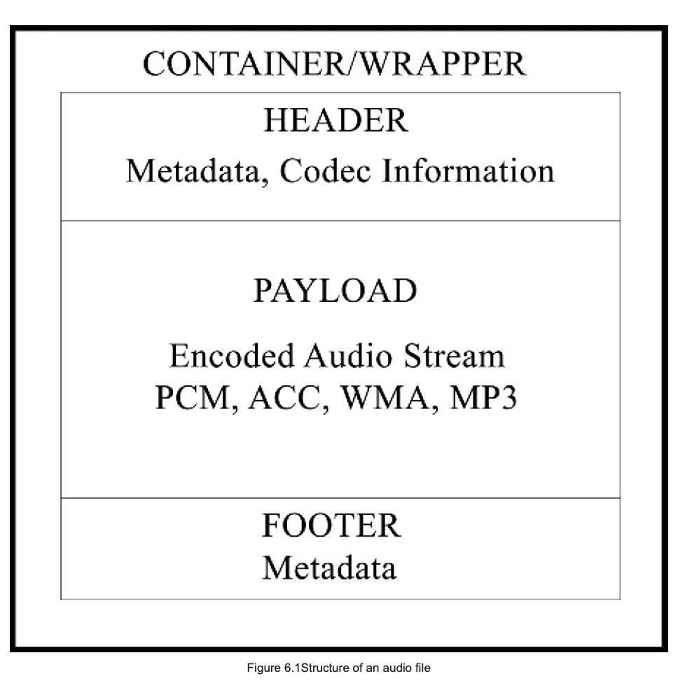
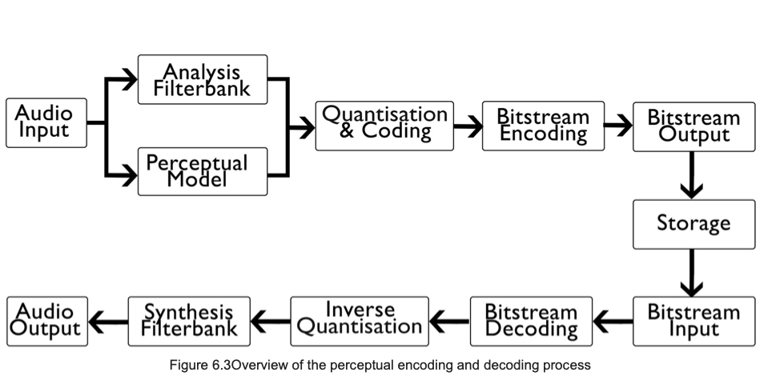

+++
title = "Audio Encoding"
outputs = ["Reveal"]
[reveal_hugo]
theme = "solarized"
# show_notes = "separate-page"
+++

[Comparison of audio coding formats](https://en.wikipedia.org/wiki/Comparison_of_audio_coding_formats)

[FFmpeg - libavcodec](https://en.wikipedia.org/wiki/Libavcodec#Implemented_audio_codecs)

{}

Head: A codec (taken from a portmanteau of the words code and decode) is a software algorithm installed on a computer operating system, capable of encoding and decoding multimedia data, of which a number of varieties exist. During the encoding stage, the raw audio data is processed by an algorithm to reduce the size of the data and thus aid in smaller file sizes.

When an audio file is saved within a file system, the encoded audio data (the stream/payload) is stored within a container or wrapper, with a filename extension associated with the container. The filename extension is used by the operating system to determine the software required to read the structure of the file and play the recording. The container holds information in relation to the codec used to encode the data (and thus the codec required to decode the data), information required by the decoder to decode the data and all metadata associated with the file (Figure 6.1). The file itself does not contain any form of codec. MP3 encoded files do not require a file container.

---

## Codec lab - FFmpeg in audacity 

* Using Audacity 
    * preferences -> FFmpeg library -> Download
    * then follow the instructions to download and locate the FFmpeg library
    * Once it's located you can now export in many different formats and codecs 
    * Export an audio file and under file type choose "Custom FFmpeg export" 
    * click "open custom FFmpeg format options", choose 3 different codecs and click "OK"
    * make sure that it works, open it in Audacity, view the metadata by clicking edit -> metadata to see if you changed the codec
    * if Audacity doesn't show you the codec try VLC. Playback -> media information -> Codec Details

{}

Show all codecs of FFmpeg with `ffmpeg -codecs` then 
* ffmpeg -encoders - more details ffmpeg -h encoder=libx264
* ffmpeg -decoders

---

## File structure 

* Use a hexadecimal editor to view the file structure of your file 
* Note the container type as the first line of the file
* Try different files to see what their container types are

---

## PCM (Pulse code modulation)

* a method in which a digital representation of an analogue signal is reconstructed through discrete amplitude and time domain sampling.
* LPCM (linear PCM), A-law, u-law, DPCM (differential PCM) and ADPCM (adaptive differential PCM)
* used in a number of standard digital audio formats, including WAVE, AIFF, DVD audio, the Redbook Standard (used by the audio CD) and transmission through HDMI.

---

## WAVE

* based on the RIFF (resource interchange file format)

{}
a file structure for the storage of multimedia data, and one which encompasses more specific file formats including AVI. It was developed by Microsoft and IBM, and first released in 1991 (Microsoft Corporation and IBM Corporation, 1991).

Uncompressed WAV PCM is one of the highest quality specifications available, as the audio data stored represents the signal directly after quantisation, without any form of compression. In these recordings, the quantised sample values are, therefore, stored as integers within the payload section of a file. 

Each sample represents a ‘sample point.’ Within stereo recordings, the samples pertaining to the left and right channels (which are replayed simultaneously on playback) are classed as ‘sample frames.’ The sample frame for mono recordings is a single sample point.

Regardless of the bit-depth, the samples are stored linearly, but there are differences between their representation when quantised to 8 bits as opposed to 9 bits or above. 8-bit quantisation values are stored as unsigned integers (so no polarity sign such as plus or minus), with a minimum value of 0 and a maximum value of 255.

---

## Compressed audio 

{}

Although the previously described formats encode audio in a manner which results in an accurate representation of the analogue signal at capture, the amount of data required to store such information can be substantial. In order to reduce the file size, and thus increase the capacity for storage and transmission, a technique known as compression is used. The theory behind this method was first proposed by C.E. Shannon in 1948, in which the limitations of data compression without losing any quality (otherwise known as lossless compression) were demonstrated. It was also proposed that codes could be used to compress information, in what is commonly referred to as Shannon Entropy. Lossless compression reduces the file size for storage during the encoding stage, but, upon decoding, the file is reconstructed without any data loss.

Lossy compression reduces the file size as above, but upon decoding, any data removed during encoding is not recovered. This results in a degree of quality degradation, the tolerance of which is based on the codec used and the settings of such. It is performed through various processes which take advantage of areas of deficiency in the human auditory system, such as critical masking and bandwidth reduction. Lossy compression produces the smallest audio file sizes available, thus explaining its popularity with streaming services and applications where storage is at a premium.

---

## Perceptual Encoding 

>the process of encoding which take advantage of the theory that humans cannot perceive all of the data being produced on playback of PCM recordings

{}
* the process of encoding which take advantage of the theory that humans cannot perceive all of the data being produced on playback of PCM recordings
* removes frequencies that we can't perceive, and thus reduces the amount of data required to store
   *  below 20 Hz or  above 20 kHz
* also removes frequencies that are masked - either simultaneous or non-simultaneous
  
---

## Perceptual encoding and decoding 

---

## Mp3 (FKA Mpeg-1 Audio Layer 3)

{}
* Many of the files you work with will be compressed. The most common compression format is MP3.
* in the 1980s the ISO brought up a need for a file type that was smaller but without a noticeable loss in quality
* Mp3 was developed by the Motion Picture Experts Group (MPEG) and is a common format for audio files.
* MPEG version 1 layer 3 was the most popular due to its efficiency, significant compression capabilities (12:1 ratio), and a tolerable degree of quality degradation for the applications which it is used. 

---

## User defined mp3 parameters

* Bitrate 
    * CBR and VBR 
* Sample rate
    * 32 kHz, 44.1 kHz, and 48 kHz 
* Channel modes 
    * single channel (monaural);
    * dual channel (two independently encoded channels or double mono);
    * true stereo;
    * joint-stereo (M/S and intensity encoding).
  
{}
* bitrate - between 8 - 320 kbps ; default is 128 kbps
    * CBR 
        * every section of the recording is encoded with the same number of bits, regardless of the complexity of the audio at that period
    * Variable distributes the bit rate based on the dynamics at a set period within the recording. The quality of VBR recordings is definable during encoding by the user as the ‘maximum bit rate,’ but it is usually the average that is provided upon viewing the specifications once decoded (Raissi, 2002).
* Sample rate
    * 32 kHz, 44.1 kHz, and 48 kHz 
* Channel Modes
    * mid side - 
    * intensity 